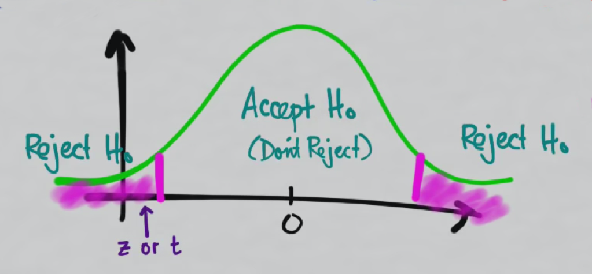

# Hypothesis Testing

**Vassilis Moustakas**

vsmoustakas@gmail.com

<!--
<a href="?theme=sky#/themes">Sky</a> -
<a href="?theme=beige#/themes">Beige</a> -
<a href="?theme=simple#/themes">Simple</a> -
<a href="?theme=serif#/themes">Serif</a> -
<a href="?theme=night#/themes">Night</a> -
<a href="?#/themes">Default</a>

<a href="?transition=cube#/transitions">Cube</a> -
<a href="?transition=page#/transitions">Page</a> -
<a href="?transition=concave#/transitions">Concave</a> -
<a href="?transition=zoom#/transitions">Zoom</a> -
<a href="?transition=linear#/transitions">Linear</a> -
<a href="?transition=fade#/transitions">Fade</a> -
<a href="?transition=none#/transitions">None</a> -
<a href="?#/transitions">Default</a>
-->

---

## Hypothesis Testing

***Hypothesis Testing***: Say something about a population by a sample taken from it.

Key procedure in ***inferential statistics***.

Applications in: drug testing, proving physics theories ([how the Higgs boson was (not) descovered](https://randomastronomy.wordpress.com/2012/07/04/higgs-boson-discovery-and-how-to-not-interpret-p-values/)), A/B testing.

Note:
https://www.youtube.com/playlist?list=PLycnP7USbo1V3jlyjAzWUB201cLxPq4NP
https://youtu.be/8b4Ynp30nIA?list=PLycnP7USbo1V3jlyjAzWUB201cLxPq4NP

---

## Hypothesis Testing Steps

1. Hypothesis
2. Sample
3. Test Statistic
4. Decision
5. P-value

---

## Hypothesis

>Cannot prove somehting is true, but can disproof something by finding an exception.

*Inferential statistics premise*

---

## Hypothesis (cont.)

***Null Hypothesis (H0)*** is a simple hypothesis associated with a contradiction to a theory one would like to prove.

***Alternative Hypothesis (H1)*** is a hypothesis (often composite) associated with a theory one would like to prove.

Note:
A/B testing parlance:
* H0 == Control (C)
* H1 == Treatment (T)

TODO: Clarify equalities for H_0 etc?

---

## Sample
Take a ***sample*** from the population. For this sample one needs to collect data (like the average blood presure or the average euros spent) to provide the statistics.

---

## Test Statistic
There are some alternatives like what is called a ***z***-score (sample means and population means using standard error) or a ***t***-score (estimated standard error).

Note:
https://youtu.be/TabT5tQEbWE?list=PLycnP7USbo1V3jlyjAzWUB201cLxPq4NP

Is hypothesized mean equal to test statistic?

https://youtu.be/ceZZt507aFY?t=397

---

## Decision

***Decision Rule*** is how we decide whether we reject or fail to reject the null hypothesis.
 

Note:
https://youtu.be/ceZZt507aFY?t=414

---

## Decision (cont.)

***Significance*** or ***significance level*** is the propability of rejecting H0 when it is true.

Examples: Say there was an impact in an A/B test while there was none or punishing the defendant when he/she was innocent.

It is known as ***type I error*** or ***α***.

---

## Decision (cont.)

Significance tells us, up to what level are we willing to believe our data?

The lower the α the lower the risk to incorectly rejecting H0 

How are we choosing level of significance? There is a good reason not to do so: people use ***0.05*** or ***5%***

Note:
https://youtu.be/ceZZt507aFY?t=538

---

## Decision (cont.)

***Confidence level*** is the certainty that the hypothesized mean (test statistic) lies within the ***confidence interval***.

`confidence level = 1 - α`

That is, with α = 0.05, the confidence level is 95% 

The larger the sample size, the higher the confidence level and narrower the confidence interval.

The higher the confidence level, the wider the confidence interval (in order to include all the possible mean values).

Note:
If the value 0 is contained in the confidence interval, then there is no significant difference between the two treatments.

---

## Decision (cont.)

The complementary of type I error is ***type II error*** or ***β*** which is the probability of failing to reject H0 when it is false.

Example: Say there was no impact in an A/B test while there was one or not punishing the defendant when he/she was guilty.

Beta value cannot be deduced but one can only ensure that there is a large enough *power* (check next slide) to ensure that one can detect a difference when it exists.

---

## Decision (cont.)

***Power*** is the probability of concluding that we made a difference when we actually made a difference.

Example: The bigger the power the more data one has to ensure the impact in an A/B test can be detected or the more evidence we have to ensure if the defendant is guilty or innocent.

---

## Decision (cont.)

Power is a function of
* The variance of the samples. But this can be controled. The more you sample the more tighter the curves ([Central Limit Theorem](http://www.nature.com/nmeth/journal/v10/n9/full/nmeth.2613.html))
* The distance the magnitude of how drastic the change you made really is. If you make a small one you need to run a long time in order to be able to distinguish between control and treatment
* The variance within your population of the the statistic. Lower variance -> less noise -> greater power

---

## P-value

***P-value*** is the probability to get a test statistic in the reject H0 region while the H0 was actually true.

Use the P-value to decide whether to reject H0

The lower the P-value the better.

Note:
https://youtu.be/ceZZt507aFY?t=685

Take 1: is the probability that,
IF H0 were true (no effect),
sampling variation would produce an estimate that is
further away from the hypothesized value than our data estimation

Take 2: How likely it is to get a result like this
if the H0 is true

---

## P-value (cont.)

* P-value < α
 * *"When p-value is low, null must go"*
 * there is very little evidence to support H0 being true
 * CI will not include the hypothesized mean
* P-value > α
 * *"When p-value is high, null must fly"*
 * there is a lot of evidence that support H0 being true
 * CI will include the hypothesized mean 

---

## References
* [Inferential Statistics](https://www.khanacademy.org/math/probability/statistics-inferential)
* [Confidence Interval or P-value?](http://www.ncbi.nlm.nih.gov/pmc/articles/PMC2689604/)
* Nature Methods - [Points of Significance](http://www.nature.com/collections/qghhqm/pointsofsignificance)
 * [Importance of Being Uncertain](http://www.nature.com/nmeth/journal/v10/n9/full/nmeth.2613.html)
 * [Power and Sample Size](http://www.nature.com/nmeth/journal/v10/n12/full/nmeth.2738.html)
* [Test statistics](https://youtu.be/TabT5tQEbWE?list=PLycnP7USbo1V3jlyjAzWUB201cLxPq4NP)
* [How to Correctly Interpret P Values](http://blog.minitab.com/blog/adventures-in-statistics/how-to-correctly-interpret-p-values)
* [Five Guidelines for Using P values](http://blog.minitab.com/blog/adventures-in-statistics/five-guidelines-for-using-p-values)
* [How to calculate P Value](http://www.wikihow.com/Calculate-P-Value)
* [Compare observed and expected frequencies](http://graphpad.com/support/faqid/1789/)
* [How Not To Run An A/B Test](http://www.evanmiller.org/how-not-to-run-an-ab-test.html) - Nice article on why you should resist leaking preliminary results.
* Do [the test](http://onlinestatbook.com/2/logic_of_hypothesis_testing/sign_conf.html)
