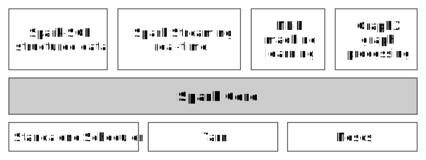

# Programming with Spark

**Vassilis Moustakas**

vsmoustakas@gmail.com

Note:

Hi. In this presentation I will try to give you a brief introduction into the world of Apache Spark.

The goal is towfold. First I'd like to give you some motivation to learn more about Spark
* Go through Spark's brief history
* See how it's different from establisted technologies like Hadoop MapReduce and reason the hype around it

Second, we will dive a bit deeper
* Check Spark's architecture and basic abstractions
* Talk about its low level API
* Elaborate on the newest high level APIs that make it even easier for software engineers and data scientist to right optimized code.

---
# What is Spark?

>>>
## Spark is...

**Spark** is a cluster computing platform designed to be *fast* and *general-purpose*

* Fast: Designed for speed for in-memory and disk computations
* General: combine diverse workloads (e.g., batch application, iterative, algorithms, interactive queries and streamming) in a single platform (reduces management burden as well)

Note:

So let's begin with answering the question "What is Spark?"

Spark's "sales pitch" is that it is a "cluster computing platform designed to be fast and general-purpose"

Fast because it is designed primarily for in-memory computations

General because its programming paradigm easily supports versatile environments from batch processing to streamming applications. Moreover, it can also run on interactive mode, making it ideal for ad-hoc analyses and data science tasks.

>>>
## Brief history of Spark

* **2009**: Spark starts as a research project in UC Berkeley RAD Lab (later AMPLab)
* **2010**: Spark gets open-sourced
* **2011**: AMPLab starts developing higher-level components (Spark Streamming etc.)
* **2013**: Spark is donated to Apache Software Foundation (now a top-level project)
* **2013**: Databricks is founded to promote Spark as the industry's standard for Big Data analytics

Note:

Here is the timeline of the important milestones that Spark project has gone through the last years.
It started as a research project at UC Berkeley and since it was open-sourced its development pace has sky-rocketed.
In 2013 it was donated to ASF and is now a top-level Apache project.
The same year, Databricks was founded. Its purpose is to promote Spark as industry's alternative to MapReduce in order to make it the the de facto standard for real-world Big Data analytics.

>>>
## Now

* Thriving and active community (e.g., [Stackoverflow's Apache Spark's tag](http://stackoverflow.com/tags/apache-spark/info), [Bay Area Spark Meetup](http://www.meetup.com/spark-users/) etc.)
 * Thousands of contributors WW including: UC Berkeley, Databricks, Yahoo! and Intel
* Impressive [Powered By Spark](http://spark.apache.org/powered-by.html) list (including Amazon!)
* One of the [top paying tech](http://stackoverflow.com/insights/survey/2016#technology-top-paying-tech) according to 2016 Stackoverflow survey ;)

Note:

Now Spark is an established open source project, arguably one with the highest development activity out there, with thousands of contributors from open-source geeks to major companies like Yahoo! and Intel.

It has also made it into the toolbox of many companies and organizations, some top notch like Amazon and the NASA's Jet Propulsion Laboratory


---
# Why Spark?

>>>
## Isn't Hadoop good enough?

**Hadoop** is an overloaded term. Refers to:
- the eco-system of the [*Apache Hadoop project*](http://hadoop.apache.org/)
- the [*Hadoop MapReduce*](https://hadoop.apache.org/docs/stable/hadoop-mapreduce-client/hadoop-mapreduce-client-core/MapReduceTutorial.html) programming paradigm

MapReduce was ground breaking because it provided:
- a simple API (simple *map* and *reduce* steps)
- *fault-tolerance*<sup>*</sup>

<sup>\*</sup> caveat: latency (between each map and reduce step, data are *shuffled* and write intermediate data to disk)

Note:
- The statement "Spark replaces Hadoop" is **wrong**
- Hadoop MR: open source implementation of Google's MapReduce
- MapReduce provides a simple API because it is the first time that relatively easily an average Gooogle SDE could program complex data pipelines scaling to 100s or 1000s of nodes
- Fault tolerance was the key feature that made this posible over big cluster of commodity hardware that likelihood of at least one node failing is very high.
- Read/write to disk: 100x slower than in-memory

>>>
## How's Spark better?

Spark achieves fault-tolerance using diffent strategy for handling latency.

Functional paradigm to the rescue!

- All data ***immutable*** and ***in-memory***
- Operations are functional transformation over data

Fault-tolerance: replay functional transformations (low latency -- [100x faster than Hadoop](https://databricks.com/blog/2014/03/20/apache-spark-a-delight-for-developers.html))

Expresiveness: almost 1-to-1 correspondence to Scala's collections API

Note:

Spark also runs on clusters of comodity hardware, which means that nodes can fail at any time.
Spark follows a different route to achieve fault tolerance with special concearn around latency.
Borrows notions from functional programming to achieve that: data are in-mamory and immutable and all operations are declarative transformations over the data. If a partition fails compute the data of that partition by reapplying the transformations on the data.
Also functional programming (similar to Scala's collections API) provides an expressive and intuitive language that is particularly applicable for data wrangling tasks.

>>>
## Spark vs Hadoop MapPreduce

|               | Spark | Hadoop MR |
|---------------|-------|-----------|
|***Processing***     | In-memory, Disk| Disk|
|***Workloads***      | Batch, Streamming, Real-time, Iterative| Batch |
|***Programming***    | Functional APIs | ETL-oriented|
|***Fault Tolerance***| Replayable functional transformations | Task Heartbeats |
|***Cost***           | Fewer more expensive clusters | More less expensive clusters 

Note:
- ETL: [Hive](https://hive.apache.org/) [Pig](https://pig.apache.org/)

http://www.datamation.com/data-center/hadoop-vs.-spark-the-new-age-of-big-data.html

https://www.xplenty.com/blog/2014/11/apache-spark-vs-hadoop-mapreduce/

https://www.digitalocean.com/community/tutorials/hadoop-storm-samza-spark-and-flink-big-data-frameworks-compared

* Processing: Spark uses memory and can use disk for processing, whereas MapReduce is strictly disk-based (results for each computation are written to HDFS).

* Workloads: Spark shows that a lot of workloads can be captured efficiently by the same, simple generalization of the MapReduce model. Spark can achieve (and sometimes beat) state-of-the-art performance in not only simple ETL, but also machine learning, graph processing, streaming, and relational queries. Importantly, this means that applications can combine these workloads more efficiently. For example, once you ETL data in, you can easily compute a report or run a training algorithm on the same in-memory data. Furthermore, you get the same programming interface to combine these jobs in, and only one system to manage and install.

How much will this matter? It's hard to predict, but one possibility is that after experimenting with specialized computing models, distributed programmers will want to have a general model, in the same way that programmers for a single machine settled on general-purpose languages. Having a general platform is even more important in big data, because data is so expensive to move across systems! In this case, Spark shows that many of the tricks used in specialized systems today (e.g. column-oriented processing, graph partitioning tricks) can be implemented on a general platform.

In any case, it is a first-order goal of the system to stay compatible with the wider Hadoop ecosystem, and just give people better ways to compute on the same data. The Hadoop ecosystem is also moving quickly towards supporting alternative programming models, through efforts like YARN.

MapReduce is a batch-processing engine. MapReduce operates in sequential steps by reading data from the cluster, performing its operation on the data, writing the results back to the cluster, reading updated data from the cluster, performing the next data operation, writing those results back to the cluster and so on. Spark performs similar operations, but it does so in a single step and in memory. It reads data from the cluster, performs its operation on the data, and then writes it back to the cluster.

* Fault Tolerance: For fault tolerance, MapReduce and Spark resolve the problem from two different directions. MapReduce uses TaskTrackers that provide heartbeats to the JobTracker. If a heartbeat is missed then the JobTracker reschedules all pending and in-progress operations to another TaskTracker. This method is effective in providing fault tolerance, however it can significantly increase the completion times for operations that have even a single failure.

Spark uses Resilient Distributed Datasets (RDDs), which are fault-tolerant collections of elements that can be operated on in parallel.RDDs can be persistent in order to cache a dataset in memory across operations. This allows future actions to be much faster, by as much as ten times. Spark’s cache is fault-tolerant in that if any partition of an RDD is lost, it will automatically be recomputed by using the original transformations.

* Cost: Both MapReduce and Spark are Apache projects, which means that they’re open source and free software products. While there’s no cost for the software, there are costs associated with running either platform. Both products are designed to run on commodity hardware, such as low cost, so-called white box server systems. MapReduce uses standard amounts of memory because its processing is disk-based, so a company will have to purchase faster disks and a lot of disk space to run MapReduce. MapReduce also requires more systems to distribute the disk I/O over multiple systems. Spark requires a lot of memory, but can deal with a standard amount of disk that runs at standard speeds.Spark systems cost more because of the large amounts of RAM required to run everything in memory. But what’s also true is that Spark’s technology reduces the number of required systems. So, you have significantly fewer systems that cost more.

---
# Core Spark Concepts

>>>
## The Spark stack



* Spark core: scheduling, distributing and monitoring of tasks in a *computing cluster*
* A diverse set of application are built on top of the core
* Designed to scale from one to many thousands of computing nodes

Note:

This diagram gives a high level depiction of the Spark software stack.

In the middle there is Spark core. This component provides
* task dispatching
* scheduling, and
* basic I/O

functionalities that are exposed via APIs that revolve around the RDD abstraction (we are going to talk about those later).

On the foundations of Spark core, higher-level APIs are provided as shown in the picture. They give programmers easier tools for them to build domain-specific applications like optimized data analytics with Spark SQL (which are also going to cover later), (near) real-time applications with Spark Streaming or efficient iterative Machine Learning with Spark MLib.

It's also designed to scale from one node to thousands of comodidty hardware nodes. This is achieved with cluster managers like the Spark Standalone scheduler that is Sparks default scheduler to established industry standards like Apache's Yarn and Mesos

>>>
## Storage layers for Spark

Spark **does not** require Hadoop.

It supports storage systems that implement the Hadoop API
* HDFS
* Any other storage system supported by the Hadoop API (e.g., local filesystem, Amazon S3, Cassandra, Hive, HBase, etc.)

Input Formats: text files, SequenceFiles, Avro, Parquet and any other Hadoop InputFormat

Note:

Spark can run in Hadoop clusters through YARN (Yet Another Resource Negotiator), it also has a standalone mode.

Note:

TODO

>>>
## Core Spark Concepts

[Glossary](http://spark.apache.org/docs/latest/cluster-overview.html#glossary)


Note:


https://www.gitbook.com/book/jaceklaskowski/mastering-apache-spark/details

>>>
## Driver Program

* Runs on its own JVM process
* User defines distributed datasets and operations to them (implicit logical DAG of operations)
* Acceses Spark via the `SparkContext` object
* Converts the user program into a physical execution plan
 * Optimized (e.g., *pipelining* map operations)
 * Split into a set of ***stage***s comprising of ***tasks***
* Schedules ***jobs*** on ***executors*** (based on availability/data placement/caching)

Note:

Stage: Each job gets divided into smaller sets of tasks called stages that depend on each other (similar to the map and reduce stages in MapReduce); you'll see this term used in the driver's logs.

Task: A unit of work that will be sent to one executor

Job: A parallel computation consisting of multiple tasks that gets spawned in response to a Spark action (e.g. save, collect); you'll see this term used in the driver's logs.

>>>
## Driver Program (2)

[SparkContext](https://github.com/apache/spark/blob/master/core/src/main/scala/org/apache/spark/SparkContext.scala): Entry point to Spark 


* Sets up internal services
* Connects to the execution environment
* Create RDDs
* Access Spark services
* Run jobs (until SparkContext is stopped)

Note:

>>>
## Executors

* Run on:
 * same JVM process as the Driver (local mode -- single executor)
 * their own JVM process (cluster mode -- multiple executors)
* Processes capable of (abstracted by the framework):
 * running tasks, and
 * storing (in-memory) data
* When started, register themselves with the driver

>>>
## Cluster Manager

(cluster mode only)

* Pluggable component (i.e., [Hadoop YARN](https://hadoop.apache.org/docs/current/hadoop-yarn/hadoop-yarn-site/YARN.html), [Apache Mesos](http://mesos.apache.org/))
* Launches executors
* In certain cases, launches the driver

>>>
## Interactive shell


SparkContext object available under the `sc` variable.

### Scala
```bash
$ $SPARK_HOME/bin/spark-shell
(...)
scala> sc
res0: org.apache.spark.SparkContext = org.apache.spark.SparkContext@28bd43b0
scala>
```

### Python
```bash
$ $SPARK_HOME/bin/pyspark
(...)
>>> sc
<pyspark.context.SparkContext object at 0x7f139d738bd0>
>>>
```
Note:

Use ```IPYTHON=1``` to use IPython or ```IPYTHON_OPTS="notebook"``` to use the browser-based version of IPython.

>>>
## Standalone applications

You create the Spark context object

```scala
import org.apache.spark.SparkConf
import org.apache.spark.SparkContext

val conf = new SparkConf().setMaster("local").setAppName("JazzyApp")
val sc = new SparkContext(conf)
(...)
```

Build your jar and submit it as a job

```bash
$ sbt package
$ SPARK_HOME/bin/spark-submit --class <class_name> <path_to_jar>
```

>>>
## Step-by-Step

1. User submits an application using `spark-submit`.
2. `spark-submit` launces the driver program and invokes the `main()` method specified by the user.
3. The driver contacts the cluster manager to ask for resources to launch executors.
4. The cluster manager launces executors on behalf of the driver program.
5. The driver process runs through the application. Based on the RDD actions and transformations in the program, the driver sends work to executros in the form of tasks
6. Tasks are run on executor processes to compute and save results.
7. If the driver's `main()` method exits or it calls `SparkContext.stop()`, it will terminate the executors and relase resources from the cluster manager.

>>>
## Who can use Spark?

* Data Scientists (data science tasks)
 * Analysing, modeling, "wrangling" data
 * Fast prototyping (ready to use ML algos)
 * Interactive shells (Scala, PySpark, Spark-SQL)
* Software Engineers (data applications)
 * Builders of data processing apps
 * Production-ready fault-tolerant distributed computation
 * Easy to monitor, inspect and tune
 * Easy and rich API (Scala, Java and Python)

Note:

TODO

---

# Spark RDD API

>>>
## An RDD is...

Spark's fundamental abstraction for distributed data and computation.

* ***Resilient***: Are *immutable* (can't be modified once created) and a deterministic function of their inputs (can be recreated at any time)
* ***Distributed***: Is split into multiple *partitions*, which may be computed on different nodes, parallely.
* ***Dataset***: Can contain any type of Scala, Java or Python objects, including user defined classes.

Note:
- This helps in taking advantage of caching. RDD isn't really a collection of data, but just a recipe for making data from other data. 
RDDs are always recomputed. When a machine holding RDD data fails, Spark uses this ability to recompute the missing partitions, transparent to the user.
- Immutability rules out a big set of potential problems due to updates from multiple threads at once. Immutable data is definitely safe to share across processes.
- They're not just immutable but a deterministic function of their input. This plus immutability also means the RDD's parts can be recreated at any time. This makes caching, sharing and replication easy.
- These are significant design wins, at the cost of having to copy data rather than mutate it in place. Generally, that's a decent tradeoff to make: gaining the fault tolerance and correctness with no developer effort is worth spending memory and CPU on, since the latter are cheap.
- A corollary: immutable data can as easily live in memory as on disk. This makes it reasonable to easily move operations that hit disk to instead use data in memory, and again, adding memory is much easier than adding I/O bandwidth.
- Of course, an RDD isn't really a collection of data, but just a recipe for making data from other data. It is not literally computed by materializing every RDD completely. That is, a lot of the "copy" can be optimized away too.

>>>
## Working with RDDs

* ***Creation***: The driver programs create RDDs in two ways:
 * loading an external dataset, or
 * distributing a collection of objects (e.g., a list or set)
* ***Transformation***: Constructs a new RDD from a previous one (e.g., filtering data that matches a predicate)
* ***Action***: Computes a result based on an RDD and either retuns it to the driver program or saves it to an external storage system (e.g., HDFS)

>>>
## Creation

Download the Spark [README.md](https://github.com/apache/spark/blob/master/README.md) from Github and load it
```scala
scala> val lines = sc.textFile("/user/vmous/README.md")
lines: org.apache.spark.rdd.RDD[String] = MapPartitionsRDD[9] at textFile at <console>:27
```

Nothing happens on the the cluster!

Creations return an RDD.

Note:

>>>
## Transformation

Filter results that contain "Scala"
```scala
scala> val scalaLines = lines.filter(_.contains("Scala"))
scalaLines: org.apache.spark.rdd.RDD[String] = MapPartitionsRDD[12] at filter at <console>:29
```

RDD in `scalaLines` variable does not get evaluated at this point either!

`filter` does not modify `lines` (remember RDDs are immutable)

Transformations return an RDD.

>>>
## Action

Count the lines of the file
```scala
scala> lines.count
res5: Long = 104
```

Count the lines of the file that contain "Scala"
```scala
scala> scalaLines.count
res10: Long = 3
```

Get the first line of the file that contain "Scala"
```scala
scala> scalaLines.first
res6: String = high-level APIs in Scala, Java, Python, and R, and an optimized engine that
```

RDDs `lines` and `scalaLines` get evaluated here.

Actions return a value of some type `T`

Note:

Any idea why?

>>>
## Evaluation Model

Transformations (+ creations) are ***lazily evaluated***

Actions are ***eagerly evaluated***

***Lineage***: Stacking up transformations generates a DAG describing all transformations that have to be applied on an RDD (including from where it has to read the data).

The lineage is evaluated whenever a result of an action needs to be computed.

>>>
## RDD Persistence

RDDs are evaluated *every* time actions are performed on them.

***Persistence*** is an optimization technique that saves interim partial results so they can be reused (useful in iterative/interactive computations).

Different [storage levels](http://spark.apache.org/docs/latest/programming-guide.html#rdd-persistence) available.

```scala
(...)
scala> scalaLines.persist
res5: scalaLines.type = MapPartitionsRDD[2] at filter at <console>:29
scala> scalaLines.count
res10: Long = 3
scala> scalaLines.first
res6: String = high-level APIs in Scala, Java, Python, and R, and an optimized engine that
```

Note:

>>>
## Advantages of Lazy Evaluation

Laziness/eagerness is how Spark deals with latency by opimizing network communication.

```scala
val lastYearsLogs: RDD[String] = ... // Humongous dataset
val firstLogsWithErrors = lastYearsLogs
                            .filter(_.contains("ERROR"))
							.take(10)
```

Execution of `filter` deferred until `take` action is applied.

In this example, as soon as 10 elements satisfying the predicate are found, computations on the humongous dataset is stopped.

Note:
In systems like Hadoop MapReduce, developers often have to spend a lot of time considering how to group together operations to minimize the number of MapReduce passes. In Spark, there is no substantial benefit to writing a singel complex map instead of chaining together many simple opreations. Theus, users are free to organized the program into smaller, more manageable operations.

Why?: Reduces the number of passes it has to take over data by grouping operation together.

>>>
## Advantages of Lazy Evaluation (2)

```scala
val lastYearsLogs: RDD[String] = ... // Humongous dataset
val firstLogsWithErrors = lastYearsLogs
                            .map(_.lowercase)
                            .filter(_.contains("error"))
							.count
```

In this example, calling `map` and `filter`, Spark knows that it can avoid multiple passes through the data and can merge filter into map.

Note:

>>>
## Pair RDDs

Big data is all about cuting and slicing collectins of key-value pairs (key design motivation of [Google MapReduce](https://static.googleusercontent.com/media/research.google.com/en//archive/mapreduce-osdi04.pdf))

Spark has special kind of RDDs with type Pair[(K, V)].

Has a ton of special functions defined in [PairRDDFunctions](https://spark.apache.org/docs/latest/api/scala/index.html#org.apache.spark.rdd.PairRDDFunctions) class (`join`, `groupByKey`, `foldByKey` etc.)

Note:

Tons of nice features that optimize nextwork communication.

>>>
## Shuffling

***Shuffling***: communication cost s/o has to pay for certain operations (i.e., `groupByKey`).

Shuffles happen transparently and are inevitable. Programmer responsible for optimizations.

* Watch out for `ShuffledRDD` return types 
```scala
scala> pairs.groupByKey() // pairs (Int, String)
res198: org.apache.spark.rdd.RDD[(Int, Iterable[String])] = ShuffledRDD[373] at groupByKey at <console>:306
```
* Use `.toDebugString` to see an RDD's execution plan
* check `.dependenies` for occurances of `ShuffledDependency`

Rule of thumb: Shuffles occur when the resulting RDD depends on other elemments of the same or another RDD.

Note:

Shuffing is moving the data across the cluster's network. Certain operations (like for example `groupByKey`) inevitably cause shuffling to happen. As you already understand this comes with an associated cost for the operations' latency. Programmers need to always be aware of such operations and optimize the jobs so that they minimize the communication overhead. Some tips are to watch out for a return type of `ShuffledRDD`. Moreover, use `toDebugString` to see an RDD's execution plan or `dependenies` and watch out for occurances of `ShuffledDependency`. All that will give you indication when certain operations can cause shuffling. 

>>>
## Shuffling (2)

```scala
val res = rdd.groupByKey().map(v => (v._1, v._2.sum)).collect()
```


>>>
## Shuffing (3)

```scala
val res = rdd.reduceByKey(_+_).collect()
```


>>>
## Partitioning


Data within an RDD is split into several ***partitions***

One partition is always in one machine but each machine can contain one or more partitions

\# of partitions: configurable (default is total number of cores on all executor nodes.
partitioning scheme: configurable (availabe: hash and range partitioners)

Note:

Example default: 6 worker nodes x 4 cores in each node = 24 partitions

>>>
## Hash Partitioning
***Hash partitioning*** attempts to spread data evenly across partitions based on key.

Partitioned according to: `p = key.hashCode() % numPartitions`

## Range Partitioning
***Range partitioning*** attempts to have keys in the same range appear on the same machine

Partitioned according to:
i. a key ordering
ii. a set of sorted ranges of keys

Note:

>>>
## Custom Partitioning

Hash partitioning is the default. Partitioning can be changed:
* explicitly, by calling `partitionBy` on an RDD, providing a `Partitioner`
* implicitly by applying transformations that return RDDs with specific `Partitioner`s (`groupByKey`)

Attention: Customizing partitioning is only possible when working with Pair RDDs (is based on keys).


>>>
## Custom Partitioning: `partitionBy`

```scala
val pairs = purchases.map(p => (p.custId, p.price))
val customPartitioner = new RangePartitioner(8, pairs)
val partitioned = pairs.partitionBy(customPartitioner).persist()
```

Why do we need `persist()`?

Note:

Let's imaging that we have an RDD of purchases which we now want to range partition its data.
We first create a pair rdd using custormer id as the key and price as value.
We then create an instance of a RangePartitioner passing the number of partitions we want and a reference to the pair RDD we want to have partitioned.
Spark is smart enough to sample the pair RDD in order to come up with an optimal selection of key ranges.
Finally, we simply invoke partitionBy on the pair's RDD, passing our custom range partitioner that we just created.

Note the call to persist(). Why do we need it here? partitionBy is a transformation and when applied all data would be shuffled over the network and partitioned. Remember that Spark's semantics is to lazy evaluate transformations so whenever an action would be applied to the partitioned rdd defined with the last command here, the chain of transformation of this slide would be re-evaluated causing the afforementioned shuffling to occur if we don't tell Spark. That is exactly the role of calling persist() here. Basically what we're doing here is we're saying: once you move the data around in the network and repartition it just keep it where it is. Otherwise, we would find ourselves accidentally re-partitioning our data in every iteration of a machine running algorithm killing the performance of your implementation.

>>>
## Custom Partitioning: Transformations

Partitioner from parent RDD

Automatically-set partitioners

Tip: `map` and `flatMap` discard Partitioner info! Use `mapValues` and `flatMapValues` instead!

Note:
It is also possible to partition using transformations. There are basically two ways partitioners can be passed around with transformations.
In the first case, and probably the most common one, partitioners are passed from parent RDD to its child. That is paire RDDs, which are the result of some transformation on an already partitioned parent paired RDD, is typically configured to use the same HashPartitioner that was used to construct its parent.
In some other cases, certain transformations automaticaly impose a partitioning that can cause re-partitioning of the data. Of course this is the case usually when it contextually makes sense. For example if you use the sortByKey operation, a RangePartitioner is used because you need ordered keys in order to sort them and the keys once sorted are partitioned such that the similar keys are in the same partition. Conversely, the default partition when using groupByKey is the hash partitioning.

>>>
## Why partitioning is important?

[8, 96, 240, 400, 401, 800], #partitions = 4

<table>
<tr>
<td style="vertical-align:middle"></td><td style="vertical-align:middle"><code>n.hashCode()=n</code><br /><code>p=k%4</code><br />imbalanced</td>
</tr>
<tr>
<td style="vertical-align:middle"></td><td style="vertical-align:middle">key ranges<br />more balanced</td>
</tr>
</table>


Note:

And something wonky happens, this hash partitioning distributes our keys as follows amongst our four partitions. Remember the goal of hash partitioning is to try and evenly spread out the keys, though it's possible to have situations like these where you have an unlucky group of keys that can cause your data. When you're clustered to be unevenly skewed, and for some nodes to have a lot more data, and for some nodes to have none, or a lot less. Of course this means potentially bad performance, because a job could be evenly spread out on four nodes. And in this case, it's basically just spread out on one node, right now, so it's not really very parallel. In this case, since we know the hash partitioning is actually skewed, and since our keys have an ordering and are non-negative.

So here's a scenario where we can more easily distribute our keys through out the cluster, that is we just put the keys in their corresponding ranges. So all keys, between 1 and 200 on the first node, all keys between 201 and 400 on the second node, etc. This is clearly much more balanced and of course we can imagine it being much more performant than before because the work is more evenly spread out.

`groupByKey` causes shuffling and results the resulting RDD to get a range partitioning.

>>>
## Why partitioning is important? (2)


Note:

The following example has been... stolen from the "Learning Spark" book and you can find detailed description with code snippets in pages 61 through 64

Consider an application that keeps a large table of user information in memory (largeRDD), say an RDD of (UserId, UserInfo) pairs, where UserInfo contains a list of topics the user is subscribed to. The application periodically needs to join this big table with a smaller RDD of (UserId, LinkInfo) pairs representing events of users clicking on a specific link. That way, for example, we could count how many users vistied a link that was not to one of their subscribed topics.

We can achieve the above we can use Spark's join method to group the UserInfo and LinkInfo pairs for each UserId by key.

If Spark does not know how the keys are partitioned in the datasets this operation will be inefficient. As we already know, by default,this operation will hash all the keys of both datasets sending elements with the same key hash across the network to the same machine and then join together the elements with the same key. Because we expect the user data RDD to be much larger than the small events RDD this shuffling is a waste especially because this join operation is performed every five minutes and the user data do not change.

>>>
## Why partitioning is important? (3)


Note:

To fix this we only need to specify a hash partitioning for the user info RDD using the partitionBy we saw earlier when we load the dataset. We choose to partition the user info RDD because this is the one that is reused every five minutes without changing. Now, when the join operation is applied, Spark knows in which machines the the user info bits are stored and it only needs to hash and shuffle the small, events, RDD. When the events bits arrive to the nodes join operation is computed right away because the needed user info data are already there. The result is that less data is communicated over the network and the programm runs significantly faster.

>>>
## When should I use RDDs?

* you want low-level transformation and actions and control on your dataset;
* your data is unstructured, such as media streams or streams of text;
* you want to manipulate your data with functional programming constructs than domain specific expressions;
* you don’t care about imposing a schema, such as columnar format, while processing or accessing data attributes by name or column; and
* you have a very good knowledge of how the platform works and you can handle the optimizations yourself

Note:
you have unstructured data
you need to fine-tune and manage low-level daetails on RDD computations
you have complex datra tyopes that cannot be serialized with Encoders
you can forgo some optimization and performance benefits available with DataFrames and Datasets for structured and semi-structured data.

https://databricks.com/blog/2016/07/14/a-tale-of-three-apache-spark-apis-rdds-dataframes-and-datasets.html

---
# Spark SQL API

>>>
## Motivation example

```scala
rdd1.join(rdd2).filter(<predicates_rdd1_rdd2>).count
```
```scala
val filtered = rdd2.filter(<predicate_rdd2>)
rdd1.filter(<predicate_rdd1>).join(filtered).count
```
~4x faster than the first
```scala
val cartesian = rdd1.cartesian(rdd2)
cartesian.filter { <join_predicate> }
  .filter { <predicates> }.count
```
~180x slower than the first!

Note:

Before we go into details on the new Spark SQL API let's see a few examples that will motivate the rest of the content in this section.

Let say that we have two RDDs, rdd1 and rdd2, and we join them together to count the data that fulfill a set of prodicates on both RDDs. That can be written as the first one liner in this slide. It's intuitive that we can get things to run faster if we join the filtered versions of the RDDs because in that case we join less data together. This leads to the second snippet shown here and to 4x reduction in run time. On the other extreme, one could implement the join operation herself using the cartesian function... accidentally increasing the runtime by about 180 times.

>>>
## Unstructured vs Structured

RDD API is opaque:
* RDDs (data)
* λ-transformaitons (computations)
* programmer should optimize the code

Databases can be highly optimized:
* Columns of named and typed values
* Declarative transformations
* an optimizer can do the work for us

Note:

The RDD API is a low level API which is very powerful but requires programmers to have detailed understanding on how Spark works under the hood. Data, in the form or RDDs, and computations, in the form of lambda transformation, are quite opaque to Spark and the programmer is expected to optimize her code and avoid pitfalls like the examples we saw in the previous slide.

In a more structured setting, we can cede some of the flexibility of the RDD API to have strictly defined, named and typed data and allow a certain set of declarative transformations on those data. Decades of academic and industry research in the area of Databases can be leveraged to take advantage of such structure to automatically optimize execution of data transformations regardless of how the operation is written by the user.

>>>
## Spark SQL

SQL: lingua franca for doing analytics

Easy SQL-like API that allows Spark to optimize execution plans.

Caveat: Give up freedom, flexibility and generality of the λ-collections API

Note:

Here is where Spark SQL comes into play. It leverages the fact that SQL is the de-facto language for data analytics to provide a modern and easy API that allows Spark to transparently optimize how things get executed. As briefly mentioned earlier this is provided with the caveat that with the SQL declarative vocabulary we give up the freedom and expressive power of free-flow functional data transformations.

>>>
## What is Spark SQL exactly

Three main APIs
* SQL literal syntax
* `DataFrame`
* `Dataset`

Backend components:
* ***Catalyst***: a query optimizer
* ***Tungsten***: an off-heap serializer

Note:

Spark SQL is two things. First, a set of APIs: an SQL literal syntax and the Dataset/DataFrame APIs. Second, a couple of backend components that enable optimization, namelly Catalyst which is a query optimizer and Tungsten an off-heap serializer for compressed and optimizes data storage in memory.

In the rest of the section we will go through each of the above in a bit more detail.

>>>
## A DataFrame is...

**An untyped immutable distributed collection of data organized into named columns**

Conceptually equivalent to RDB table or R/Python data frames

**untyped**: Scala compiler doesn't type-check its schema

DataFrames contain `Row`s which can contain data for some defined ***schema***

DataFrames are lazily evaluated.

Transformation on DataFrames a called ***untyped transformations***

Note:

https://databricks.com/blog/2015/02/17/introducing-dataframes-in-spark-for-large-scale-data-science.html
Predicate push-down: The optimizer can push filter predicates down into the data source, enabling the physical execution to skip irrelevant data. In the case of Parquet files, entire blocks can be skipped and comparisons on strings can be turned into cheaper integer comparisons via dictionary encoding. In the case of relational databases, predicates are pushed down into the external databases to reduce the amount of data traffic.

Can choose intelligently between broadcast joins and shuffle joins to reduce network traffic. It can also perform lower level optimizations such as eliminating expensive object allocations and reducing virtual function calls. As a result, we expect performance improvements for existing Spark programs when they migrate to DataFrames.

>>>
## Creating an SQL Spark Session

Create an SQL Spark session
```scala
import org.apache.spark.sql.SparkSession
(...)
val spark = SparkSession
  .builder()
  .appName("example")
  //.config("log4j.logger.org.apache.spark", "ERROR")
  .getOrCreate()
```

Stopping it

```scala
spark.close()
```

Note:

SparkSessions contain a SparkContext. The standard name used to access it in notebooks (Zepellin or Databricks) is `spark`

>>>
## Creatting a DataFrame

* Convert an existing RDD (infering the schema or providing it)
* Read in a ***data source*** from file (JSON, csv, Parquet etc.)

>>>
## Converting an existing RDD

```scala
import spark.implicits._
val peopleRDD = ... // RDD[(Int, String, String)]
val tupleDF = tupleRDD.toDF("id", "name", "city")
```
If column names are not provided, Spark assigns numbers.

```
val case class Person(id: Int, name: String, city: String)
val peopleRDD = ... // RDD[Person]
val peopleDF = peopleRDD.toDF
```
Column names are infered via reflection.

In both cases the schema is inferred (how Scala types map to SQL types)

>>>
## Converting an existing RDD (2)

```scala
val fields = List(
    StructField("id", IntegerType, true),
    StructField("name", StringType, true),
    StructField("city", StringType, true))
val schema = StructType(fields)
val rowPeopleRDD = peopleRDD
  .map(attr => Row(attr._1, attr._2, attr._3))

val peopleDF = spark.createDataFrame(rowPeopleRDD, schema)
```

```scala
scala> peopleDF
res201: org.apache.spark.sql.DataFrame = [id: int, name: string ... 1 more field]
```

>>>
## Reading in a data source from file

```scala
val df = spark.read.json("<path_to_json>")
```

Check the [`DataFrameReader`](https://spark.apache.org/docs/latest/api/scala/index.html#org.apache.spark.sql.DataFrameReader) to see the (semi-)structured data sources supported.

>>>
## DataFrame API

Well-known, structured, SQL-like operations: `join`, `where`, `limit`, `orderBy`, `groupBy`, `join`

Remember on RDDs we used arbitrary user-defined λ-literals

Use `show()` to head the first 20 elements of the DataFrame
Use `printSchema()` to get the tree-formatted schema of the DataFrame

>>>
## DataFrame Aggregations

First call `groupBy` on some column(s).

[`RelationalGroupedDataset`]((https://spark.apache.org/docs/latest/api/scala/index.html#org.apache.spark.sql.RelationalGroupedDataset), returned above, provides functions like `count`, `sum`, `min`, `max` etc.

Tip: `agg` enables extending aggregations with [SQL functions](https://spark.apache.org/docs/latest/api/scala/index.html#org.apache.spark.sql.functions$).

```scala
df.groupBy($"<colname1>")
  .agg(count($"<colname2"))
```

>>>
## Data Clean-up with DataFrames

Unwanted values (`null` or "NaN"):
* Delete records : `drop()`, `drop("all")`, `drop(Array("id", "name"))`
* Replace values: `fill(0)`, `fill("balance" -> 1000000)`, `replace(Array("id"), Map(1234 -> 4321))`

>>>
## Motivation example in DataFrames
```scala
df1.join(df2, df1("id") === df2("id"), "inner")
  .filter(<predicate_df2>)
  .filter(<prdicate_df1>)
  .count
```

This is also ~4x faster than the RDD

Spark did all the optimization for us.

>>>
## Optimizations

Catalyst query optimizer: compiles Spark SQL down to RDDs

Catalyst by understanding:
* Data-types
* Data-set schema
* Kind of computations

...can:
* re-arrange the execution plan (fuse together filter ops, run them as early as possible or push expensive ops down to the data layer)
* skip unused data (reduce communication cost)
* prun unneeded partitioning

Note:

Compared to RDDs:
* imposes a structure to the distributed data collection and thus an easier domain specific language API
* offers, state-of-the-art optimizations
 * logical (e.g., predicate push-down)
 * physical (e.g., compiles ops in [JVM bytecode](https://databricks.com/blog/2014/06/02/exciting-performance-improvements-on-the-horizon-for-spark-sql.html))

>>>
## Optimizations (2)

Tungsten off-heap data encoder

Tungsten by understanding all Spark SQL datatypes, provide:
* highly specialized data encoding (optimal serialization, more data fit in memory and faster (un-)marshalling)
* columned-oriented storage (most-operations done on tables tend to focus on specific columb rather than rows- faster lookups etc - column based databases like Redshift)
* off-heap (memory regions manually managed by Tungsten avoids overhead due to garbage collection)

>>>
## DataFrame limitations

Untyped!

```scala
df.filter($"state" === "CA")
```
Code will compile even if there is no "state" column available

Need to cast elements in rows to certain types (`row.AsInstanceOf[Integer]`).

Limited datatypes. Problem because you cannot easily reuse the complex classes that your application already has.

Requires (Semi-)Structured data-set

Note:

So, this can be not just annoying because you have exceptions every now and then, but it can also be a little bit verbose and hard to read because you'll find yourself writing row.AsInstanceOfInteger

>>>
## Datasets motivation

```scala
val avgPrices = avgPricesDF.collect()
// avgPrices: Array[org.apache.spark.sql.Row]
val avgPricesAgain = avgPrices.map {
	row => (row(0).asInstanceOf[String], row(1).asInstanceOf[Int])
}
```

Note:

This can fail again at run-time if, for example, the second column is of type Double instead of Integer. In that case you need to update the code to use `.asInstanceOf[Doublet]`

>>>
## A Detaset is...

**A typed immutable distributed collection of data organized into named columns**

[DataFrame is Dataset of type Row](https://spark.apache.org/docs/latest/api/scala/index.html#org.apache.spark.sql.package@DataFrame=org.apache.spark.sql.Dataset[org.apache.spark.sql.Row])
```scala
type DataFrame = Dataset[Row]
```

Dataset API unifies DataFrame and RDD APIs.
* continue use relational declarative ops and benefit from catalyst optimizations
* add more *typed* operations
* add support for high order functions and intermix literals with sql declarations

>>>
## Creating Datasets

From Scala collections
```scala
List("foo", "bar").toDS // requires import spark.implicits._
```

From RDD
```scala
myRdd.toDS // requires import spark.implicits._
```

From data source as file
```scala
val ds = spark.read.json("<path_2_json>").as[Person]
``` 

From a DataFrame
```scala
df.toDS // requires import spark.implicits._
```

>>>
## Dataset Aggregations

First call `groupByKey`

[`KeyValueGroupedDataset`](https://spark.apache.org/docs/latest/api/scala/index.html#org.apache.spark.sql.KeyValueGroupedDataset), returned above, provides functions to get a Dataset

Tip: `agg` enables extending aggregations with [SQL functions](https://spark.apache.org/docs/latest/api/scala/index.html#org.apache.spark.sql.functions$).

```scala
df.groupBy($"<colname1>")
  .agg(count($"<colname2"))
```

>>>
## Catalyst cannot optimize all Dataset operations

Relational Operations can be optimized
```scala
ds.filter($"city".as[String] === "Boston")
```

λ filter operation ***cannot*** be optimized
```scala
ds.filter(p => p.city == "Boston")
```

>>>
## Unified Apache Spark 2.0 API

Starting in Spark 2.0, `Dataset` takes on two distinct API characteristics:
* a **strongly-typed** API (`Dataset[T]` where `T` a strongly-typed JVM object), and
* an **untyped** API `(DataFrame` == `Dataset[Row]` where `Row` is generic untyped JVM object)

>>>
## Unified DataFrame/Dataset APIs Illustrated


>>>
## Unified DataFrame/Dataset APIs Benefits

Benefits of the unification:
* Static-typing and runtime type-safety
* High-level abstraction and custom view into structured and semi-structured data
* Ease-of-use of APIs with structure
* Performance and Optimization

Note:

Consider static-typing and runtime safety as a spectrum, with SQL least restrictive to Dataset most restrictive.
* SQL with not catch syntax errors until runtime
* DataFrames catch syntax errors (e.g., invoking a function on DataFrame that is not part of the API) at compile time. It will not catch analysis errors (e.g., non-existing column name) until runtime
* Datasets catch both syntax and analysis errors at compile time

>>>
## When should I use DataFrames/Datasets?

* If you want rich semantics, high-level abstractions, and domain specific APIs, use DataFrame or Dataset.
* If your processing demands high-level expressions, filters, maps, aggregation, averages, sum, SQL queries, columnar access and use of lambda functions on semi-structured data, use DataFrame or Dataset.
* If you want higher degree of type-safety at compile time, want typed JVM objects, take advantage of Catalyst optimization, and benefit from Tungsten’s efficient code generation, use Dataset.
* If you want unification and simplification of APIs across Spark Libraries, use DataFrame or Dataset.
* If you are a R user, use DataFrames.
* If you are a Python user, use DataFrames and resort back to RDDs if you need more control.

Note:

Use Datasets when:
* you have (semi-)structured data
you want typesafgetyu
you need to work with functional APIs
you need good perfomance, but it doesn't have to be the best

Use DataFrames when
you have (semi-)structured data
you want the best possible performance, automatically optimezed of you

---
# Best Practices and Tuning

>>>
## Use caching for iterative/interactive computations

Avoid unknowingly re-evaluation of several transformation

Despite similar-looking API to Scal Collection, the deferred semantics of Spark's RDDs are very unlike Scala Collections.

Due to:
- lazy semantics of RDD transformation operation
- users' implicit reflex to assume collections are eagerly evaluated

>>>
## Avoid GroupByKey

Especially if you want to reduce things afterwards. .groupByKey.reduce > .reduceByKey

Use specialized reducings and aggreations

They know how to do **map-side** reduction (values computed locally to each node). Of course requires a pre-partitioned RDD. this means that the corresponding RDD should 

This means do reductions before groupBys when possible

https://databricks.gitbooks.io/databricks-spark-knowledge-base/content/best_practices/prefer_reducebykey_over_groupbykey.html

For paired data, if you find yourself writing code where you `groupByKey()` and then use a `reduce()` or `fold()` on values, you can probably achieve the same result more efficiently by using one of the per-key aggregation functions. Rather than reducing the RDD to an in-memory value, we reduce the data per key and get back and RDD with the reduced values corresponding to each key. FOr example `rdd.reduceByKey(func)` produces the same RDD as `rdd.groupByKey().mapValues(value => value.reduce(func))` but is more efficient as it avoids the step of creating a list of values for each key.

Note:

>>>
## Pre-partition before joins

Make sure you partition both datasets with the same partitioner and cached on the same machine.

Especially when joining because otherwise Spark will shuffle things around.

When you load the data call `partitionBy` and then `persist`


>>>
## Don't copy all elements of a large RDD to the driver.

https://databricks.gitbooks.io/databricks-spark-knowledge-base/content/best_practices/dont_call_collect_on_a_very_large_rdd.html

Note:

>>>
## Gracefully Dealing with Bad Input Data

https://databricks.gitbooks.io/databricks-spark-knowledge-base/content/best_practices/dealing_with_bad_data.html

Note:

>>>
## Partitioning


Tip: `map` and `flatMap` loose Partitioner info! Use `mapValues` and `flatMapValues` instead!


Communication is very expenisve, so laying out data to minimize network traffic can greatly inprove performance.

Partitioning is not always helpful: if a given RDD is scanned only once, there is no point in partitioning it in advance.

It is useful only when a dataset is reused *multiple times* in key-oriented operations such as joins.

Hash-partitioning: Hash an RDD into 100 partitions so tha keys tha havee the same hash value modulo 100 appear on the same node.

Range-partitioning: Range partition an RDD into sorted ranges of keys so that elements with keys in the same range appear on the same node.

As of Spark 1.0 operations that benefit from partitioning are `cogroup()`, `groupWith()`, `join()`, `leftOuterJoin()`

>>>
## Use `mapValues` instead of `map`

You cannot accidentally change the key of the key-value pairs of your data-set.

Preserves the partitioner (no shuffling) because it does not change they keys.

>>>
## More Best Practices and Tuning

https://www.gitbook.com/book/databricks/databricks-spark-knowledge-base/details

https://robertovitillo.com/2015/06/30/spark-best-practices/

Note:

>>>
## Optimizations

Spark performs several optimization such as:
* *pipelining* map transformations to gether to merge them
* converts execution graph into a set of *stages*

Each stage, in turn, consists of multiple tasks. The tasks are bundled up and prepared to be sent tot he cluster. Tasks are the smallest unit of work in Spark.

>>>
## Fault tolerance

Spark automatically deals with failed or slow machines by re-executing failed or slow tasks

For example, if the node running a partition of a `map()` operation crashes, Spark will rerun it on another node; if node slow Spark can preemptively launch a *speculative* copy of the task on another node and take its result if that finishes first.

Even if no node fails Spark may have to rerun a task to rebuild a cached value that falls out of memory.

---
# References

>>>
## If you are the book type

[](http://www.jdoqocy.com/click-7645222-11260198?url=http%3A%2F%2Fshop.oreilly.com%2Fproduct%2F0636920028512.do%3Fcmp%3Daf-strata-books-videos-product_cj_9781449358600_%2525zp&cjsku=0636920028512)

* Driver: The Spark shell

>>>
## If you are the Green Party type

* http://lintool.github.io/SparkTutorial/slides/day1_main.pdf
